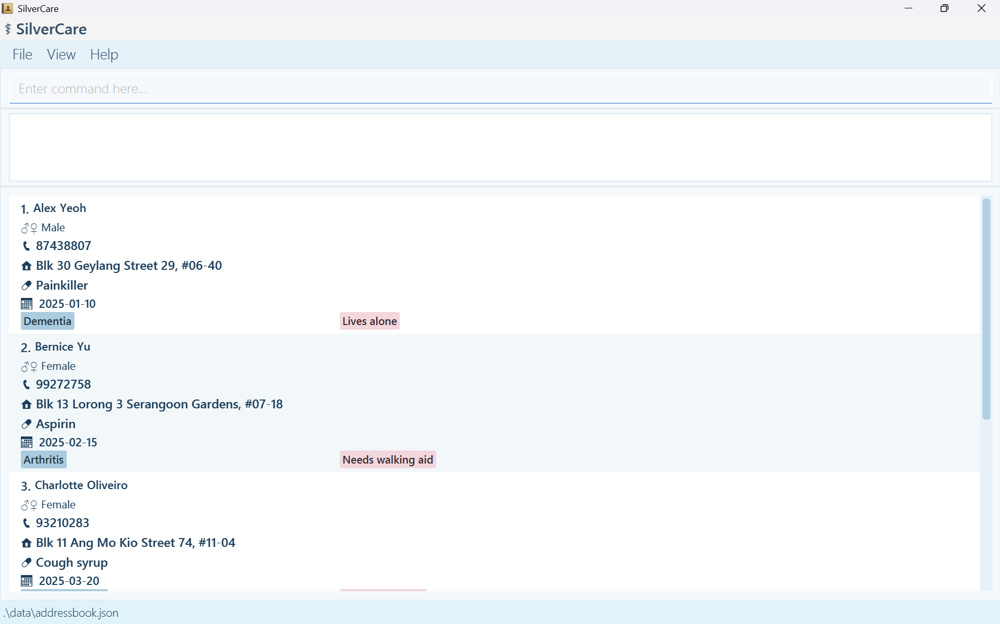
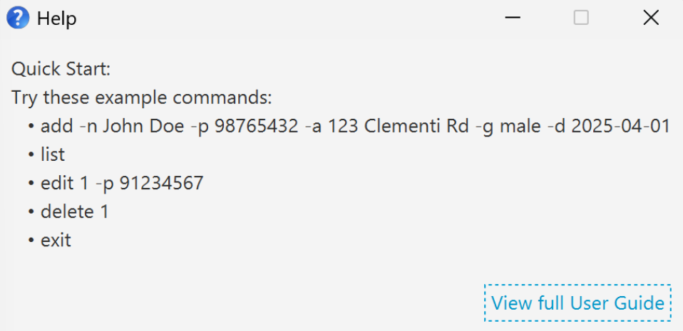
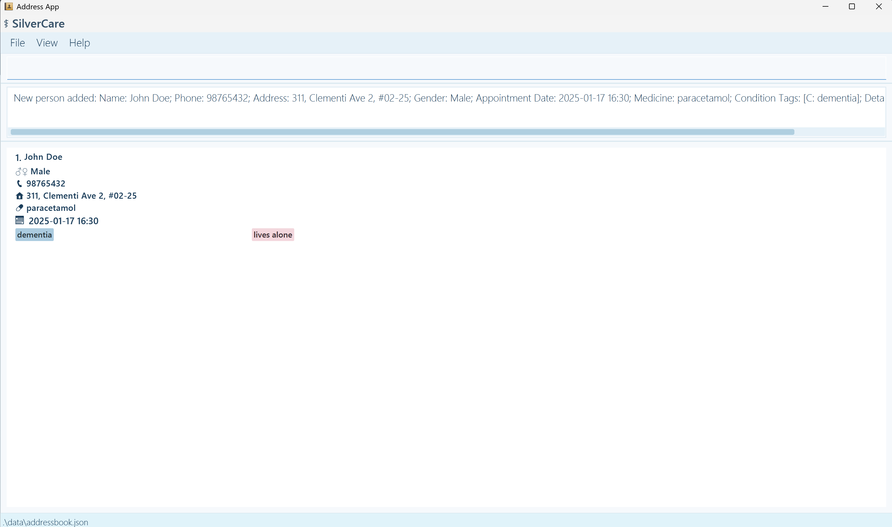
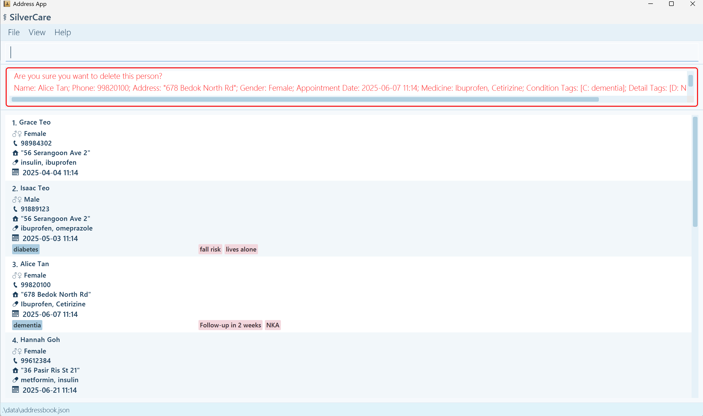
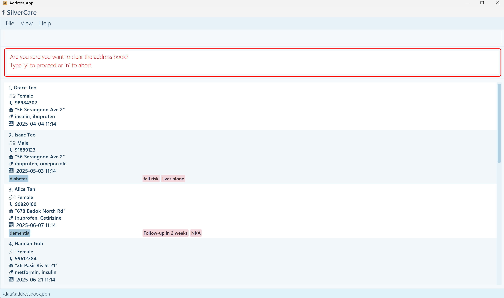
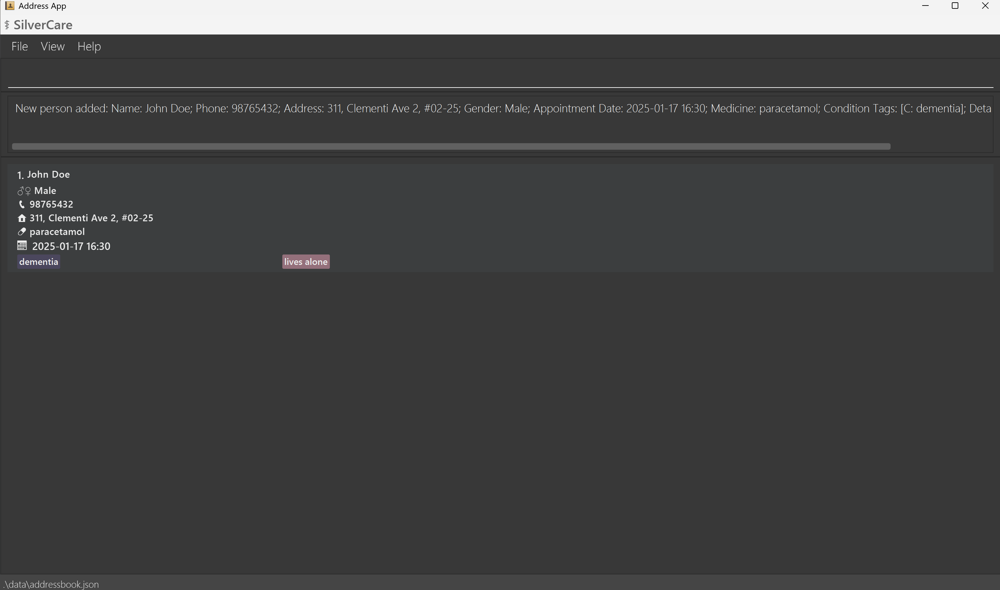

**Welcome to SilverCare!**

SilverCare is a **simple desktop app** that helps you keep track of your patients during home visits.
It’s built to be **fast** and **easy** to use, so you can spend less time on admin and more time with your patients.

Most actions, like adding a new patient or looking someone up, are done by typing **short commands**.
It might seem unfamiliar initially, but it becomes second nature with some practice.

There are also a few helpful buttons for things like getting help, changing the colour theme, or closing the app, just what you need, without the clutter.

* Table of Contents
{:toc}

--------------------------------------------------------------------------------------------------------------------

## Quick start

1. Check if Java is installed
   
    Make sure your computer has Java 17 or above installed.
   
    **Installation:** Please follow the installation instructions for [Windows](https://docs.oracle.com/en/java/javase/17/install/installation-jdk-microsoft-windows-platforms.html#GUID-DAF345BA-B3E7-4CF2-B87A-B6662D691840)/[Mac](https://se-education.org/guides/tutorials/javaInstallationMac.html)/[Linux](https://docs.oracle.com/en/java/javase/17/install/installation-jdk-linux-platforms.html) users.
2. Click [here](https://github.com/AY2425S2-CS2103T-T12-4/tp/releases) to download SilverCare's latest .jar file (this is the app).
3. Create a folder named ‘SilverCare’ in your Desktop.
4. Move the downloaded file into the folder.
5. Open the app
   * For Windows users, open Command Prompt and enter the following:
     1. `cd Desktop/SilverCare`
     
        OR `cd OneDrive/Desktop/SilverCare` if your Desktop is in OneDrive
     2. `java -jar silvercare.jar`
   * For Mac/Linux users, open Terminal and enter the following:
     1. `cd Desktop/SilverCare`
     2. `java -jar silvercare.jar`

   

6. Start fresh!

   When you first open SilverCare, you might see some sample patient data already filled in.
   To clear this and start with your own records, just type: `clear`

7. Need [help](#viewing-help--help)? It’s always nearby
   
   You can open a quick help window anytime by:
   * Typing: help
   * Pressing F1, or
   * Clicking the Help button at the top menu bar.

The Help window shows example commands to get you started, and even includes a link back to this full user guide, so you can return here anytime if you need more details.

8. Explore more [features](#features) below
   
   Scroll down to learn how to add, search for, and manage your patients using simple commands.

9. You're ready to go! That’s it, SilverCare is set up and ready. Start managing your patient records with ease!

> For a quick overview, check out our [Command Summary](#command-summary), which lists all the key commands in one place.

--------------------------------------------------------------------------------------------------------------------

## Features

**:information_source: Notes on Command Format:** 

Before jumping into the features, here are a few simple tips on how commands work in SilverCare:

* Words in CAPITAL LETTERS are parameters that you need to fill in.
    
    e.g. `add -n NAME` means you should type something like `add -n John Doe`.
* Square brackets [ ] mean something is optional.

    e.g. -n NAME [-c CONDITION] can be used as `-n John Doe -c High BP` or just `-n John Doe`.
* Three dots (…​) mean you can include that part as many times as you need.

    e.g. `[-c CONDITION]…​` allows you to type nothing e.g. `-c` or `-c High BP -c Diabetic -c Asthma`
* Command parts can be entered in any order.

    So `-n John -p 91234567` and `-p 91234567 -n John` both function the same.
* Extra input won’t break commands like list, help, exit, or clear.

    e.g. help 123 is treated the same as help. 

> **Tip for PDF users:** If you’re copying commands from a PDF version of this guide, double-check that no spaces are missing around line breaks, as sometimes PDF formatting removes them.

### Viewing help : `help`

Typing `help` opens a small window that gives you a quick overview of basic commands you can try out. It’s a great way to get started without needing to remember everything right away.

**Need more info?**

The Help window also has a “View full User Guide” button that links back to this page, so you can always come back here anytime you need more detailed instructions.

**How to open the Help window:**
* Type: help
* Press F1 on your keyboard
* Or click the Help button in the top menu bar

### Adding a person: `add`

Use this command to add a new patient to SilverCare.

**Command Format:** `add -n NAME -p PHONE -a ADDRESS -g GENDER [-d APPOINTMENT DATE] [-c CONDITION]…​ [-det DETAIL]…​ [-med MEDICINE]`

##### Field options:

Required Fields:
* -n NAME: Patient’s full name (e.g. John Doe)
* -p PHONE: Contact number (e.g., 91234567)
* -a ADDRESS: Home address (e.g., 45 Bukit Timah Rd)
* -g GENDER: Gender (e.g. male, female, M, F)

Optional Fields:
* -d APPOINTMENT DATE: Appointment date

    Formats accepted: yyyy-MM-dd or yyyy-MM-dd HH:mm (e.g. 2025-04-10, 2025-04-10 14:30)
* -c CONDITION: Medical condition(s) (e.g., High BP)

    You may include multiple by repeating -c
* -det DETAIL: Additional notes or details (e.g. lives alone)
  * You may include multiple by repeating -det
* -med MEDICINE: Prescribed medicines (e.g. Panadol, Antibiotics)

:bulb: **Tips:**

* List all medicines as one string, separated by commas. (No need to repeat -med for each item.)

* A person can have any number of conditions and details. (including 0)

:exclamation: **Important Notes:**

* You can store up to 30 patients in SilverCare. Adding beyond this limit will not be allowed.
* Phone numbers must be unique; trying to add a patient with an existing number will result in an error.

**Examples:**
* `add -n John Doe -p 98765432 -a 123 Clementi Rd -g male`
* `add -n Mary Tan -p 91234567 -a 45 Bukit Timah Ave -g female -d 2025-04-10 -c Diabetes -c High BP -det Allergic to penicillin -med Metformin, Aspirin`

### Listing all persons : `list`

Use this command to view all the patients currently in your SilverCare records.

**Command Format:** `list`

When you run this command, SilverCare shows a list of all patients:

* Patients with appointment dates are shown first and sorted by the nearest upcoming appointment.
* Patients without appointment dates appear after, in the order they were added, newest at the bottom.

This way, you can easily focus on who you need to see soon, while still keeping track of everyone else.

### Editing a person : `edit`

Use this command to update the details of an existing patient.

**Command Format:** `edit INDEX [-n NAME] [-p PHONE] [-a ADDRESS] [-g GENDER] [-d APPOINTMENT DATE] [-c CONDITION]…​ [-det DETAIL]…​ [-med MEDICINE]`

* `INDEX` refers to the number shown beside each patient in the list. It must be a positive number (e.g. 1, 2, 3...).
* You must include at least [one field](#field-options) to update.
* Fields that you don’t specify will remain unchanged.

:bulb: **Tips:**

* To remove all conditions or details, simply type `-c` or `-det` without anything after it.
* Medicine is entered as a single string, not multiple repeated flags. (e.g. `-med Panadol, Omeprazole`)

:exclamation: **Important Notes:**

* When editing conditions or details, existing entries will be fully replaced. This means the previous conditions/details will be cleared before your new ones are added.
* **Phone numbers must be unique.** If you try to edit a patient’s phone number to one that already exists in the system, the command will fail.

**Examples:**
* `edit 1 -p 91234567` Changes the phone number of the first patient to 91234567.
* `edit 2 -n Betsy Crower -c ` Changes the name of the second patient and removes all existing conditions.
* `edit 3 -det Follow-up in 2 weeks -det NKA -med Ibuprofen, Cetirizine` Replaces all existing details with two new ones and updates medication info.

### Locating persons by name: `find`

Use the find command to search for patients by name, appointment date, or to view upcoming appointments. This helps you quickly locate the right records, especially when your patient list grows.

1. Find by **Name**: `find -n NAME`
   
   Searches for patients whose **names** include the keyword you type.
   
   **Command Format:** `find -n KEYWORD [MORE_KEYWORDS]`
   * Case-insensitive: john matches John, JOHN, or johnny.
   * Partial matches allowed: Typing Ann will match Anna, Annabelle, etc.
   * Search is flexible: Keywords can be in any order.
   * At least one match required: Results will include any patient whose name matches any of the keywords.

   **Examples:**
   
    `find -n John`  e.g. returns John Lim.
   
    `find -n grace tan` e.g. returns Grace Teo and Alice Tan

2. Find by **Appointment Date**: `find -d APPOINTMENT DATE`

   Searches for patients who have an appointment on a specific date.
   **Command Format:** `find -d YYYY-MM-DD [HH:mm]`
   * Date must be in the correct format, with HH:mm being optional
   * Date must be a valid date
   * Results will include all patients with matching appointment dates.
   
   **Example:** `find -d 2026-12-21`

3. Find **Upcoming Appointments**: `find upcoming`
   
   Shows all patients with appointment dates that are after today’s date.
   
   **Command Format:** `find upcoming`
   * Automatically filters for future appointments.
   * Sorted by the nearest upcoming date first.
   > If there are no upcoming appointments, the system will let you know.

### Deleting a person : `delete`

Use this command to remove a patient’s contact and medical information from SilverCare.

**Command Format:** `delete INDEX`
* `INDEX` refers to the number shown beside the patient in the list.
* It must be a positive whole number (e.g. 1, 2, 3...).

Before the deletion happens, SilverCare will show the patient’s details and ask you to confirm:

`Are you sure you want to delete the contact with the following details? (y/n)`
* Type y to confirm deletion
* Type n to cancel

:bulb: **Tips:**

* If you enter an invalid index (like 0, -1, or something that doesn’t exist), the system will prompt you to try again.
* If you cancel the deletion (n), the patient’s data will stay safe.

**Examples:**
* Deleting through main list
  1. `list` returns list of patients.
  2. `delete 2` prompts a confirmation to delete patient with the 2nd index.
  3. [y] will result in the 2nd patient deleted from the full list.
* Deleting through filtered search
  1. `find -n` Betsy returns list of patients names containing Betsy.
  2. `delete 1` prompts a confirmation to delete patient with the 1st index.
  3. [y] will result in the 1st patient deleted from the filtered search results.

:exclamation: **Important Notes:**

* If you run another command (like list, help, etc.) during the prompt, the deletion will be automatically cancelled.

### Clearing all entries : `clear`

This command removes all patient records from SilverCare.

**Command Format:** `clear`

Before clearing, the app will ask you to confirm by typing 'y' (yes) or 'n' (no), so you won’t accidentally lose your data.

### Exiting the program : `exit`

Closes the SilverCare app.

**Command Format:** `exit`

You can also close the app using the Exit button in the top menu.

### Saving the data

There’s no need to manually save anything, SilverCare automatically saves your data after every change (like adding or editing a patient).

### Editing the data file (Optional)

If you're an advanced user, you can find and edit SilverCare's data directly:

**Location:** `[JAR file folder]/data/addressbook.json`

The data is stored in JSON format, which you can open with any text editor.

:exclamation: **Important:**
Be sure to follow the correct JSON structure when editing this file.

// format to follow in file

A small mistake (like a missing comma or quotation mark) can cause the app to stop working properly.

If you're unsure, it's best to make changes through the app itself using commands.

### Switch Themes: Toggle Theme
SilverCare supports both light and dark modes.

You can switch between them anytime:
* Click the Toggle Theme button under the View menu in the top-left corner.

Dark Mode

--------------------------------------------------------------------------------------------------------------------

## FAQ

**Q**: The app doesn’t open when I run it. What should I check?

**A**: Here are some common issues to troubleshoot:
* Java not installed or wrong version 

  Make sure Java 17 or above is installed.
  
  You can check this by running: `java -version`
* File name or location changed 

  Make sure the file is still named silvercare.jar and hasn't been renamed by accident.
* Not in the right folder

   Open your terminal or command prompt and navigate (cd) to the folder where silvercare.jar is located before running:
   `java -jar silvercare.jar`

**Q**: What happens if I type the command wrongly?

**A**: Don’t worry, SilverCare has built-in error handling. If you make a mistake in your command format (like missing a field or typing something incorrectly), the app will:
* Show an error message
* Give you an example of the correct format so you can try again

    Example: If you type `add -n John`, SilverCare will tell you that required fields are missing and show you the correct format.

**Q**: How do I transfer my data to another computer?

**A**: When you first run SilverCare on a new computer, it automatically creates a data file in a folder named data, located in the same folder as the app (silvercare.jar).

To transfer your data:
1. Install Java and place silvercare.jar on the new computer.
2. Run the app once, this will create the default data file (data/addressbook.json).
3. Close the app.
4. On your old computer, go to the folder where you last used SilverCare. Inside the data folder, find the file named:

   `addressbook.json`
5. Copy this file to a USB drive or cloud storage.
6. On your new computer, replace the newly created addressbook.json file in the data folder with the one from your old computer.
7. Reopen SilverCare and your old data should now be visible.

> If your .jar file is in Documents/SilverCare, your data file will be at:
Documents/SilverCare/data/addressbook.json

**Q**: How do I transfer my data to another Computer? 
**A**: Install the app in the other computer and overwrite the empty data file it creates with the file that contains the data of your previous SilverCare home folder.

--------------------------------------------------------------------------------------------------------------------

## Known issues

1. **When using multiple screens**, if you move the application to a secondary screen, and later switch to using only the primary screen, the GUI will open off-screen. The remedy is to delete the `preferences.json` file created by the application before running the application again.
2. **If you minimize the Help Window** and then run the `help` command (or use the `Help` menu, or the keyboard shortcut `F1`) again, the original Help Window will remain minimized, and no new Help Window will appear. The remedy is to manually restore the minimized Help Window.

--------------------------------------------------------------------------------------------------------------------

## Command summary

Action | Format, Examples
--------|------------------
**Add** | `add -n NAME -p PHONE -a ADDRESS -g GENDER [-d APPOINTMENT DATE] [-c CONDITION]…​[-det DETAILS]…​[-med MEDICINE]`   e.g. `add -n James Ho -p 22224444 -a 123 Clementi Rd -g male -d 2023-10-10 -c HIGH BP -det lives alone -med paracetamol, ibuprofen`
**Clear** | `clear` (Asks for confirmation before deleting all records)
**Delete** | `delete INDEX`  e.g., `delete 3` (Asks for confirmation before deleting the selected patient)
**Edit** | `edit INDEX [-n NAME] [-p PHONE] [-a ADDRESS] [-g GENDER] [-d APPOINTMENT_DATE] [-c CONDITION]…​[-det DETAILS]…​[-med MEDICINE]`  e.g.,`edit 2 -n James Lee -p 92131231 -c Asthma -med panadol, omeprazole`
**Find** name | `find -n KEYWORD [MORE_KEYWORDS]`  e.g., `find -n James Jake `
**Find** date | `find -nd yyyy-MM-dd [HH:mm]`  e.g., `find -d 2025-06-12`
**Find** upcoming | `find upcoming`
**List** | `list` (Sorted by upcoming appointments first. Those without dates appear in order added.)
**Help** | `help` or click the Help button in the menu bar
**Toggle Theme** | **(Button only)** Click the Toggle Theme button under the View menu (top-left) to switch between light and dark modes
